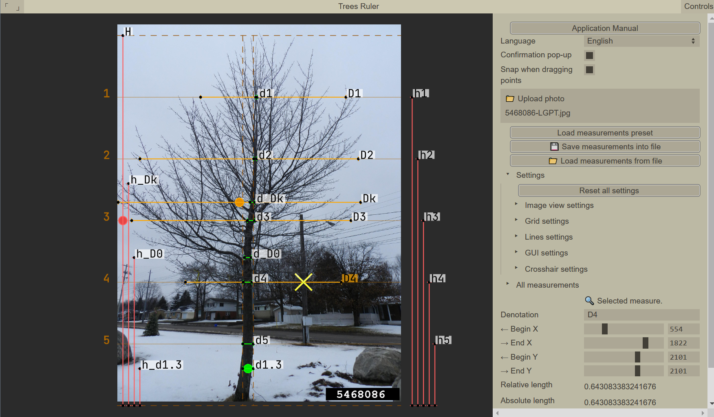

# TreeMT: Trees Measuring Tool for Forest Taxonomy / Программа метрии деревьев
> ! Инструкция на русском внизу страницы \
> ! The description in Russian follows
## Description
* Makes easier the manual labor of trees measuring:
   * input: full-height images of trees
   * helps calculating heights and widths of tree crowns relative to tree height
   * helps calculating intermediate tree trunk diameters relative to the tree's base diamater
   * output: measurements as numbers in the interface, or as a text file
* The application is portable and runs in a web-browser (implemented with JavaScript / P5.js)
* The application is authored by: Alexey Larionov:
   * email: alxs.larionov@gmail.com
   * openreview: https://openreview.net/profile?id=~Alexey_Larionov1

## Some implementation features
* Fully client-side (nothing is sent anywhere)
* Saving and loading settings preferences in Cookies 
* Full switcheable localization for English and Russian
* Dynamic configuration of all parameters from the menu, including colors
* Mouse interaction for placing measurements, snapping them to each other, and placing a measurement grid, zooming into the image and panning over the image
* Rotating the image (SHIFT + arrows)
* Saving results to a file and loading from a file to continue the work (YAML text format)



## Running the application:

There might be my web-site running with this application, try:
 * [http://www.graphicsfore.pics](http://www.graphicsfore.pics)
 * [http://95.85.71.64](http://95.85.71.64)

## Running the application locally

### Option 1:

1. Follow installation process of `p5.js`, install or activate a local HTTP server in some way:
https://github.com/processing/p5.js/wiki/Local-server

2. Download this repository's source code, and configure the chosen server, so that it serves the repository root.

3. The application should be available. Try opening the next link in your browser, substituting the `<port_number>` with the port number from the configuration of your running server
   ```
   http://127.0.0.1:<port_number>/index.html
   ```

### Option 2 (Windows)
You can try to launch executable [./libs/bin/RebexTinyWebServer.exe](./libs/bin/RebexTinyWebServer.exe) from this repository, it should automatically start a server. Then open in the browser: [http://127.0.0.1:5501/index.html](http://127.0.0.1:5501/index.html)

## Application usage

Please press button (Application Manual) in the menu window (on the right), to see the most relevant state of the instructions. Here's a shorter version:

### Key mapping
* `Mouse wheel`: zoom in/out
* `Right mouse btn` (press and hold): move the photo
* `Left mouse btn` (click): select a measurement:
	- (hold and move a measurement's endpoint): move the endpoint
  - (press and move a measurement line): move the whole line
* `SHIFT` (hold): the endpoints won't snap to parallel X/Y coordinates of other measurements 
* `CTRL` (hold): the lines will be hidden (should help to place the measurements more accurately)
* `ESCAPE`: duplicate the selected measurement
* `DELETE`: delete the selected measurement (can't delete the unit measurement, delete the group instead)
### Example usage
1. Press `Upload photo` button and select a file
2. The application menu has folders and sub-folders. Press a folder name to reveal its content (e.g. folder `Settings`)
3. Folder `All measurements` is divided into groups of measurements. New groups can be created with a corresponding button `New measurement group`. A unit measurement will be placed on the photo, its length will be considered 1.0, and all other measurements in the groups will compte their length relative to this unit.
4. Settings of a particular group are located in the corresponding group folder. You can change: 
   - group color
   - group denotation (e.g. with group denotation 'a', all measurements in the group will be called by default 'a0', 'a1', etc.
   - absolute length of the unit (e.g. if a group measures relative to the tree height, and you know the tree height in meters, you can enter it here, and other measurements in the group will additionally have absolute lengths).
5. In the group folder, try using button `Add measurement`.
6. Notice, that under this button, there are buttons corresponding to all the created measurements. Pressing those buttons, the measurement info will appear in the bottom section of the mnu with mark `🔍 Selected measurement`. In this section you can change sliders of coordinates (in case you can't do so on the photo), and you can give a special denotation for this particular measurement.
7. Create groups and measurements, place them with mouse on the photo (drag lines or endpoints, for convenience the latter will snap to parallel endpoints). The measurements of a single group are denoted with a single color, the unit measurement additionally has a circle in the line's center. Near the line there is denotation of the measurement and its relative (and/or absolute length in parentheses)
1. Additionally you can place a grid on the photo (look around in `Settings`-`Grid settings` folder. You can adjust the grid from the menu, or by dragging the dashed grid lines on the photo.
1. For convenience, use button `Load measurements preset`, to quickly greate common groups (for measuing tree height, crown diameter, trunk diameter). The measurements are generated according to the grid location.
1. Measurements can be saved in a file; and later loaded from a file (and displayed on the photo)

## Licenses of used materials

* the license of [`p5.js`](https://p5js.org/) can be found at https://github.com/processing/p5.js/blob/main/license.txt
> Copyright notice:
>
> The p5.js library is free software; you can redistribute it and/or modify it under the terms of the GNU Lesser General Public License as published by the Free Software Foundation, version 2.1.

* the license of [`guify`](https://github.com/colejd/guify) by  Jonathan Cole
> Copyright 2019 Jonathan Cole (jons.website)
> 
> Permission is hereby granted, free of charge, to any person obtaining a copy of this software and associated documentation files (the "Software"), to deal in the Software without restriction, including without limitation the rights to use, copy, modify, merge, publish, distribute, sublicense, and/or sell copies of the Software, and to permit persons to whom the Software is furnished to do so, subject to the following conditions:
>
> The above copyright notice and this permission notice shall be included in all copies or substantial portions of the Software.
>
> THE SOFTWARE IS PROVIDED "AS IS", WITHOUT WARRANTY OF ANY KIND, EXPRESS OR IMPLIED, INCLUDING BUT NOT LIMITED TO THE WARRANTIES OF MERCHANTABILITY, FITNESS FOR A PARTICULAR PURPOSE AND NONINFRINGEMENT. IN NO EVENT SHALL THE AUTHORS OR COPYRIGHT HOLDERS BE LIABLE FOR ANY CLAIM, DAMAGES OR OTHER LIABILITY, WHETHER IN AN ACTION OF CONTRACT, TORT OR OTHERWISE, ARISING FROM, OUT OF OR IN CONNECTION WITH THE SOFTWARE OR THE USE OR OTHER DEALINGS IN THE SOFTWARE.

* the license of [`yaml.js`](https://github.com/jeremyfa/yaml.js) by Jeremy Faivre
> Copyright (c) 2010 Jeremy Faivre
> Permission is hereby granted, free of charge, to any person obtaining a copy of this software and associated documentation files (the "Software"), to deal in the Software without restriction, including without limitation the rights to use, copy, modify, merge, publish, distribute, sublicense, and/or sell copies of the Software, and to permit persons to whom the Software is furnished to do so, subject to the following conditions:
>
> The above copyright notice and this permission notice shall be included in all copies or substantial portions of the Software.
>
> THE SOFTWARE IS PROVIDED "AS IS", WITHOUT WARRANTY OF ANY KIND, EXPRESS OR IMPLIED, INCLUDING BUT NOT LIMITED TO THE WARRANTIES OF MERCHANTABILITY, FITNESS FOR A PARTICULAR PURPOSE AND NONINFRINGEMENT. IN NO EVENT SHALL THE AUTHORS OR COPYRIGHT HOLDERS BE LIABLE FOR ANY CLAIM, DAMAGES OR OTHER LIABILITY, WHETHER IN AN ACTION OF CONTRACT, TORT OR OTHERWISE, ARISING FROM, OUT OF OR IN CONNECTION WITH THE SOFTWARE OR THE USE OR OTHER DEALINGS IN THE SOFTWARE.

* the license of [`RebexTinyWebServer`](https://github.com/rebexnet/RebexTinySftpServer) by 
Rebex.NET

> Rebex Sample Code License
> 
> Copyright (c) 2015-2020, Rebex CR s.r.o. www.rebex.net, 
> All rights reserved.
> 
> Permission to use, copy, modify, and/or distribute this software for any purpose with or without fee is hereby granted
>
> THE SOFTWARE IS PROVIDED "AS IS", WITHOUT WARRANTY OF ANY KIND, EXPRESSED OR IMPLIED, INCLUDING BUT NOT LIMITED TO THE WARRANTIES OF MERCHANTABILITY, FITNESS FOR A PARTICULAR PURPOSE AND NONINFRINGEMENT. IN NO EVENT SHALL THE AUTHORS OR COPYRIGHT HOLDERS BE LIABLE FOR ANY CLAIM, DAMAGES OR OTHER LIABILITY, WHETHER IN AN ACTION OF CONTRACT, TORT OR OTHERWISE, ARISING FROM, OUT OF OR IN CONNECTION WITH THE SOFTWARE OR THE USE OR OTHER DEALINGS IN THE SOFTWARE.

* icons:
> Downloaded from https://icons8.com/icon/17593/forest
> 
> Forest icon by "https://icons8.com"

* font: Jetbrains Mono
> Copyright 2020 The JetBrains Mono Project Authors (https://github.com/JetBrains/JetBrainsMono)
>
> This Font Software is licensed under the SIL Open Font License, Version 1.1.
>
> This license is available with a FAQ at: https://scripts.sil.org/OFL

* example images:
> The images were downloaded from this http://www.forestryimages.org/.
>
> All the rights on this photographs are reserved by the web-site http://www.forestryimages.org/ and the photographers that shot them.

---

## Описание
* Программа упрощает ручной труд по измерению параметров деревьев
   * входные данные: фотографии деревьев в полный рост
   * программа позволяет расставлять базовые замеры (их длина берется за единицу 1.0), и расставлять другие замеры, длина которых будет считаться относительно базового
   * выходные данные: числа измерений отображающиеся внутри программы, или в виде текстового файла (что может помочь в последующей автоматической обработке)
* Программа работает внутри Интернет-браузера, поэтому проблемы не должно быть много проблем в совместимостью (программа написана на JavaScript на основе библиотеки p5.js)
* Автор программы: Алексей Ларионов
   * email: alxs.larionov@gmail.com
   * openreview: https://openreview.net/profile?id=~Alexey_Larionov1

### Запуск программы

Возможно, будет доступен один из моих сайтов с этим приложением, попробуйте открыть в браузере одну из ссылок:

- [http://95.85.71.64](http://95.85.71.64)
- [http://www.graphicsfore.pics](http://www.graphicsfore.pics)

## Запуск программы локально

Если сайты не работают, программу можно запустить на собственном компьютере.

### Вариант 1:

1. Нужно запустить локальный HTTP сервер на своем компьютере, вот несколько вариантов (на английском языке):
https://github.com/processing/p5.js/wiki/Local-server

2. Скачайте архив с кодом этого приложения:
- через программу `git` в консоли:
   ```
      git clone https://github.com/laralex/TreesRuler.git
   ```
- или со [страницы с релизами](https://github.com/laralex/TreesRuler/releases)
1. Разархивируйте в какую-то папку, и сконфигурируйте сервер на эту апку.

1. Программа должна стать доступка. Попробуйте открыть в браузере ссылку вида
   ```
   http://127.0.0.1:<port_number>/index.html
   ```
   (заменив `<port_number>` на номер порта из конфигурации сервера)

### Вариант 2 (Windows)
Скачайте архив с кодом как в варианте 1, разархивируйте и запустите программу, находящуюся в [./libs/bin/RebexTinyWebServer.exe](./libs/bin/RebexTinyWebServer.exe), это должно запустить сервер, и можно будет открыть ссылку в браузере: [http://127.0.0.1:5501/index.html](http://127.0.0.1:5501/index.html)

## Лицензирование
Пожалуйста, следуйте лицензии, которая описана на английском выше в секции "Licenses of used materials"